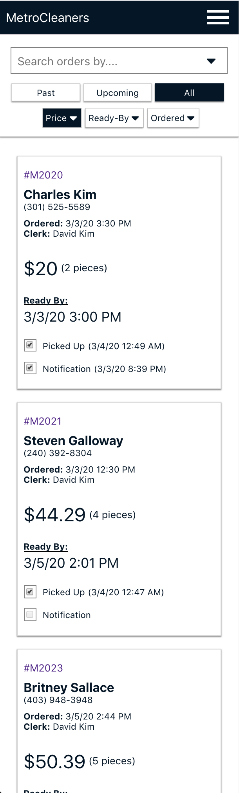
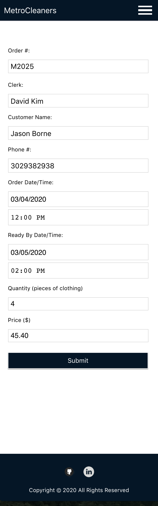
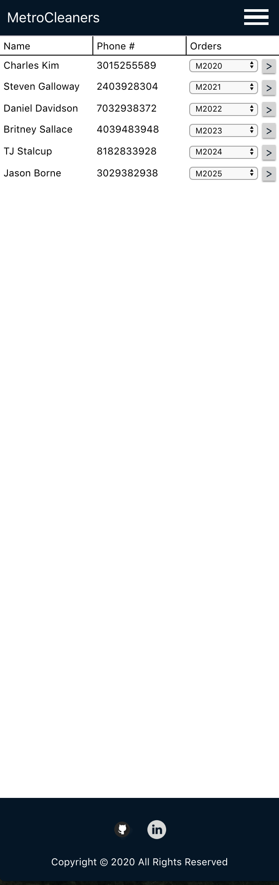

# MetroCleaners App

### Demo: https://metrocleaners-app.now.sh/

MetroCleaners App is a customer relationship management app for local drycleaning businesses that keeps track of customers and their orders while using automated SMS notifications via Twilio API to keep them in the loop.

- An order form is filled out for every drycleaning order that keeps track of each customer's order information (phone number, name, order date, ready-by date, quantity, and price)
- In the background, a cronjob runs every minute to check to see if there are any orders that are ready for pickup and sends an automated SMS notification letting the customer know their order is ready for pick up
- On the frontend, the app is making a GET-request to the order's API endpoint every minute to check and see if any new notifications have been sent out, and updates the UI accordingly
- Each new customer entered into the app is stored in the customers database along with their order history, allowing the business owner to keep track of their customer base to better serve them

# Screenshots

#### Home Screen:

#### + New Order Form:

#### Customer's List:

# How To Use

1. Once you sign-up for an account, use your username and password to sign-in
2. Once you sign-in, use the navbar to navigate to the '+ New Order' form where you will fill in all the details pertaining to each order
3. No need to fill out a separate form for customers, as the form will check to see if the customer already exists or not in the database and if they don't, the app will automatically store the new customer's information along with the order details.
4. When you come back to fill another order by an already existing customer, you can use the autocomplete feature to select the customer name, which will automatically populate their phone number for convenience
5. Once an order is submitted successfully, the app will automatically send out SMS notifications on the 'Ready-By Date' of each order and the 'Notification' checkbox will automatically be checked along with a timestamp of when the notification was sent.
6. Once the order has been picked up, check the 'Picked Up' checkbox to store the date and time of when the order was picked up.
7. Clicking on the order # on the top-left corner of each order's card will take you to the order's detail page, which will list all releveant details and eventually an itemized receipt. There is also a text-box where you can manually send an SMS to the customer if the order has not been picked up after a period of time.
8. To see all registered customers and their order history, navigate to 'Customers' using the navbar and use the dropdown to navigate to any of their previous order details page.

### Tech

- HTML
- CSS
- Javascript
- React

# Post-Up Api

### Demo: https://metrocleaners-app.now.sh/

This API services the MetroCleaners App. All endpoints are protected and require a JWT.

# Base-URL

https://warm-meadow-39006.herokuapp.com/api

# Auth Endpoints

#### /auth/login

# Admins Endpoints

#### /admins

# Customers Endpoints

#### /customers

# Clerks Endpoints

#### /clerks

# Orders Endpoints

#### /orders

#### /orders/:id

# SMS Endpoints

#### /sms

### Tech

- NodeJS
- Express
- Knex
- Morgan
- Cors
- Helmet
- Twilio API
- NodeCron

### For Testing

- Mocha
- Chai
- Supertest
